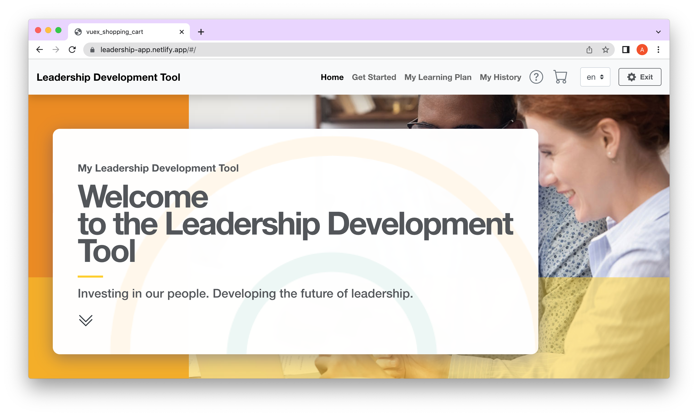

# Vue Shopping Cart

## Intro

A shopping cart style application built using Vue2, Vuex, BootstrapVue, and animate.css based on a tutorial by [Akash Ingole](https://www.youtube.com/watch?v=irr7ACcmW_4).

Designed based on an ecomm/shopping cart functionality, the app channels users from a landing page, to a products library, funneling to a 'cart' displaying all chosen products, and a final download/checkout process.  There is LMS functionality archiving user downloads for future reference (SCORM cloud), and IE detection with an automatic alert directing users to use a more modern browser.

## Details

The project uses vuex, vue-router, SASS, vue-i18n for french translation, and is tailored for use on an LMS (`.xml` files are located in the `xml_files` folder, and router config in `router/index.js`). Animation was built custom using Intersection Observer and animate.css.

## Notes

This section details development and process notes, fixes, bugs, etc.

1. Any added/redundant `d-flex` classes will break row/col layout in IE11. BSVue rows come with display `flex` out of the box, and `col` classes receive flex treatment as children of the rows.
2. As of this writing, `object-fit: cover` does not work in IE, so be aware of image styling using this property.
3. Dynamic Vue `:style` bindings appear to break IE. Be sure to test and/or avoid them if IE functionality is necessary.